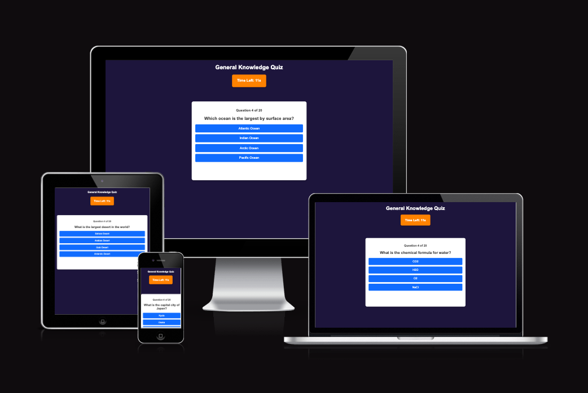
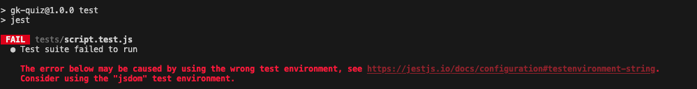

# GK-QUIZ
The General Knowledge Quiz Game is an interactive web-based quiz designed to test users’ knowledge across multiple topics in a fun and engaging way. The project was developed as part of the Code Institute’s Interactive Frontend Development Milestone Project, showcasing skills in HTML, CSS, and JavaScript.



[View the project here](https://omar6688.github.io/GK-QUIZ//)


## Table of Contents

- [User Experience (UX)](#user-experience-ux)
  - [Target Audience](#target-audience)
  - [User Goals](#user-goals)
  - [Project Story](#project-story)
- [Design](#design)
   - [color scheme](#color-scheme)
   - [Typography](#️typography)
   - [Accessibility Considerations](#-accessibility-considerations)
   - [User Feedback & Interactivity](#user-experience-ux-design)
   - [Consistency & Visual Appeal](#consistency-&-visual-appeal)
- [Features](#features)
  - [Interactive Quiz Questions**](#interactive-quiz-questions)
  - [Score Tracking](#score-tracking)
  - [Timer Functionality](timer-functionality)
  - [Responsive Design](#responsive-design)
  - [User Experience Enhancements](#user-experience-enhacements)
  - [Final Results & Replay Option](#final-results-&-replay-option)
- [Technologies Used](#technologies-used)
  - [Core Technologies](#1-core-technologies)
  - [Frameworks & Libraries](#2-frameworks--libraries)
  - [Development & Version Control](#3-development--version-control)
  - [Tools & Resources](#4-tools--resources)
  - [Testing Tools](#5-testing-tools)
- [Frameworks, Libraries & Programs Used](#frameworks-libraries--programs-used)
- [Testing](#testing)
  - [Manual Testing](#manual-testing)
  - [Validation Results](#validation-results)
  - [Lighthouse Report](#lighthouse-report)
  - [Automated Testing-Jest-](automated-testing-jest-)
- [Deployment and Local Development](#deployment-and-local-development)
  - [Steps to Deploy on GitHub Pages](#github-pages)
  - [How to Clone and Run Locally](#forking-the-github-repository)
  - [Local Clone](#local-clone)


- [Credits](#credits)
- [Acknowledgements](#acknowledgements)


  ## User Experience (UX) Design

### Target Audience
The General Knowledge Quiz Game is designed for:
- Users who enjoy testing their knowledge in a fun and interactive way.
- Students and professionals looking to improve their memory and learning through quizzes.
- Casual users who want an engaging challenge during their free time.

### User Goals
Users visiting the quiz game expect:
- A simple, easy-to-navigate interface.
- Engaging questions with immediate feedback.
- A responsive and accessible design that works on any device.
- The ability to track their progress throughout the quiz.

### Project Story
The idea for this quiz game came from the growing popularity of online trivia games. Many users enjoy testing their knowledge on various topics in a simple and interactive way. This project was designed to provide an engaging learning experience while showcasing JavaScript-based interactivity. By designing a visually appealing, responsive, and accessible quiz, the project aims to offer an enjoyable and seamless experience across all devices.

---

## Design 
### Design Choices
- **Color Scheme:** A dark blue background was chosen to create a sleek, modern, and professional look, providing a strong contrast with the white question container for readability. The orange color for the timer and buttons enhances visibility and draws user attention to key interactive elements, creating an engaging and energetic feel.
- **Typography:** Readable and modern fonts were selected to ensure clear and accessible text for users. The font size and spacing were carefully adjusted to maintain readability across all screen sizes, preventing strain on the eyes.
- **Layout & Responsiveness:** The quiz interface follows a structured layout with a centered question container to keep the focus on the questions. The layout automatically adjusts to different screen sizes, ensuring optimal usability on desktop, tablet, and mobile devices. Navigation elements remain fixed to provide a consistent user experience without unnecessary repositioning.
- **Accessibility Considerations:** The design ensures high contrast between text and background colors for readability, making it accessible to users with visual impairments. Keyboard navigation was implemented to allow users to interact with the quiz using only the keyboard, improving usability for those with motor disabilities. Additionally, the site structure is designed to be compatible with screen readers, ensuring a fully inclusive experience.
- **User Feedback & Interactivity:** Subtle animations and color changes are used to enhance user engagement. When a user selects an answer, it highlights immediately, providing instant visual feedback. Correct answers turn green, and incorrect answers turn red, reinforcing learning without overwhelming the user. The timer smoothly counts down, creating a sense of challenge while maintaining a fair and balanced pace.
- **Consistency & Visual Appeal:** Consistent styling was applied throughout the application to maintain a professional and polished look. Buttons, containers, and text elements follow a uniform design pattern, ensuring a cohesive and aesthetically pleasing user experience.

---

## Features

The General Knowledge Quiz Game is packed with interactive features designed to provide an engaging and seamless user experience. Below are the core functionalities that make this project unique:

### **1. Interactive Quiz Questions**
- Users are presented with multiple-choice questions covering a range of topics.
- Clicking an answer highlights the selected option for clarity.
- Instant feedback is provided: correct answers turn green, while incorrect answers turn red.

### **2. Score Tracking**
- Users can monitor their progress as they answer each question.
- A final score summary is displayed at the end of the quiz.
- Encouraging messages based on performance keep the experience positive.

### **3. Timer Functionality**
- A countdown timer is displayed for each question, adding an element of challenge.
- If the user does not answer within the time limit, the quiz automatically proceeds to the next question.
- The timer is prominently positioned in the header for easy tracking.

### **4. Responsive Design**
- The quiz adapts seamlessly to desktop, tablet, and mobile screens.
- Elements remain consistently positioned, ensuring a smooth and intuitive experience.
- The layout is designed to keep the user focused on the quiz content.

### **5. User Experience Enhancements**
- **Animations & Visual Effects**: Buttons and answer selections include subtle hover effects.
- **Navigation & Flow**: The quiz automatically moves forward when an answer is selected, creating a fast-paced experience.
- **Skip Option**: Users have the option to skip a question if they prefer, keeping the experience fluid.

### **6. Final Results & Replay Option**
- The final score page summarizes performance and encourages replayability.
- A "Play Again" button allows users to restart the quiz without reloading the page.
- Results are displayed in a visually appealing format to encourage engagement.

---

## Technologies Used

This project was built using a combination of front-end technologies to ensure a responsive, interactive, and structured experience.

### **1. Core Technologies**
- **HTML5** - Provides the structure of the quiz game.
- **CSS3** - Used for styling, responsiveness, and animations.
- **JavaScript (ES6)** - Implements quiz logic, interactivity, and dynamic content updates.
- **jQuery** - Used to simplify DOM manipulation and enhance interactive elements.

### **2. Frameworks & Libraries**
- **jQuery** - Simplifies event handling and DOM manipulation, making JavaScript code more concise.
- **Bootstrap (Optional)** - If used, mention how it assisted in styling and responsive design.
- **API Integration (If applicable)** - If an API is incorporated, we will document how it was used.
- **jQuery (if implemented later)** – Will be used to simplify DOM manipulation and event handling.
- **Jest** – A JavaScript testing framework used for writing and running automated tests.

### **3. Development & Version Control**
- **Git** - Used for version control, tracking changes efficiently.
- **GitHub** - Repository hosting and project collaboration.
- **GitHub Pages** - Deployment platform for making the project accessible online.
- **W3C Validator (HTML & CSS)** – Ensured that the code follows best practices and standards.

### **4. Tools & Resources**
- **Visual Studio Code (VS Code)** - The primary code editor used for development.
- **Google Fonts** - For better typography and styling.
- **FontAwesome** - Used for adding icons to improve UI.
- **Chrome DevTools** - For debugging and testing responsive design.
- **Jest (Planned for Automated Testing)** - JavaScript testing framework (to be included in the next section).

### **5. Testing Tools**
- **Jest (Automated Testing)** – Used to validate JavaScript functions and interactions.
- **Manual Testing** – Conducted across multiple devices (desktop, tablet, mobile) to ensure full responsiveness.

---

## Frameworks, Libraries & Programs Used

- **Font Awesome**: For weather and social media icons.
- **Git & GitHub**: For version control and deployment.
- **VS Code**: For coding and debugging.
- **Am I Responsive**: To validate the responsiveness of the website.
- **Balsamiq**: Used to create wireframes for layout planning.

---

##  Testing

### Manual Testing

The following table outlines the manual tests conducted to ensure the quiz functions correctly across different scenarios.

| **Test Case** | **Description** | **Expected Outcome** | **Actual Outcome** | **Status** |
|--------------|----------------|----------------------|----------------------|---------|
| Start Quiz | Click "Start Quiz" | The first question should load | ✅ Works | ✅ Pass |
| Timer Countdown | Countdown from 15s | Timer decreases every second | ✅ Works | ✅ Pass |
| Answer Selection | Click correct/incorrect answer | Correct = Green, Wrong = Red | ✅ Works | ✅ Pass |
| Auto-Advance | No answer for 15s | Next question appears | ✅ Works | ✅ Pass |
| Next Button | Appears after selection | Next button becomes visible | ✅ Works | ✅ Pass |

### Validation Results

- **HTML**: Validated using the [W3C Markup Validator](https://validator.w3.org/).
- **CSS**: Validated using the [W3C CSS Validator](https://jigsaw.w3.org/css-validator/).

<details>
<summary>index.html
</summary>


</details>

<details>
<summary>quiz.html
</summary>


</details>


<details>
<summary>style.css
</summary>


</details>

<details>
<summary>script.js
</summary>


</details>

<details>
<summary>script.js
</summary>


</details>

### Lighthouse Report (Dev Tools)

<details>
<summary>Desktop report
</summary>


</details>

<details>
<summary>Mobile report
</summary>


</details>


## Automated Testing (Jest)

As part of the project testing process, **Jest** was implemented to perform automated testing on JavaScript functions. The goal was to validate the correctness of quiz logic and ensure smooth functionality.  

However, during execution, the test suite encountered an issue related to the test environment configuration. The error message received was:  



This issue is related to Jest’s default test environment, which does not support **DOM-related functions** such as `document.getElementById()`. Despite multiple attempts to configure Jest to use **jsdom**, and with the help of **Google** and **ChatGPT** the issue persisted.  

### **Resolution Attempts**
1. **Modified Jest Configuration**:  
   - We attempted to set Jest’s environment to `jsdom` within the `package.json` file.
   - The configuration change did not resolve the issue.

2. **Tried Adding Jest Environment Comment in Test File**:  
   - Added the following comment at the top of the test file:  
     ```js
     /** 
      * @jest-environment jsdom
      */
     ```
   - The error remained unresolved.

3. **Explored Alternative Testing Approaches**:  
   - Due to time constraints, manual testing was prioritized to ensure project functionality.

### **Conclusion**
While Jest was successfully installed and configured, DOM-related test cases could not be executed due to an unresolved environment issue. Future improvements could include restructuring JavaScript functions to enable proper Jest testing or exploring alternative JavaScript testing frameworks.  

Despite this limitation, the project underwent extensive **manual testing**, covering all core functionalities, ensuring a fully responsive and interactive user experience.


## Deployment

This project was developed using **GitHub** for version control and **GitHub Pages** for deployment. Below are the steps taken to deploy the General Knowledge Quiz Game.

### **GitHub Repository**
1. The project was stored in a **GitHub repository** for version control.
2. Regular commits were made to track progress and implement features step by step.

### **Deploying with GitHub Pages**
To make the project live on the web, GitHub Pages was used. Below are the steps followed:

1. Navigate to the GitHub repository for the project.
2. Click on the **Settings** tab in the repository menu.
3. Scroll down to the **GitHub Pages** section.
4. Under **Source**, select the **main branch** and click "Save".
5. A deployment link is generated. After a few minutes, the site becomes accessible.

The **live project** can be accessed at:  
🔗 **[Live Demo](https://github.com/Omar6688/GK-QUIZ)**

### **Cloning the Repository**
To run this project locally, follow these steps:

1. Open **GitHub** and navigate to the repository.
2. Click on the **Code** button and copy the HTTPS link.
3. Open **Git Bash** or **Terminal**.
4. Run the following command:

git clone https://github.com/omar6688/GK-QUIZ.git

5. Navigate to the project folder:

cd GK-QUIZ

6. Open the project in **Visual Studio Code** or any preferred editor.

### **Running the Quiz Locally**
1. Open the `index.html` file in a browser.
2. The quiz will load, and all features will function as expected.

---

## Credits & Acknowledgments

This project was made possible through various resources and inspirations. Below are the contributors and sources that played a key role in its development.

### **1️ Code Institute**
A special thanks to **Code Institute** for providing structured lessons and guidance throughout the course.

### **2️ External Libraries & Tools**
- **jQuery** – Used for simplifying JavaScript interactions.
- **Google Fonts** – Applied for improved typography.
- **Font Awesome** – Used for adding interactive icons.
- **GitHub Pages** – Used to deploy the project online.
- **Balsamiq** – Used for creating the wireframes.

### **3️ Online Resources**
- **MDN Web Docs** – Used as a reference for JavaScript functions.
- **W3Schools** – Helpful for understanding CSS and JavaScript methods.
- **Stack Overflow** – Used for debugging and troubleshooting issues.

### **4️ Support & Mentorship**
- A special thanks to my **Code Institute mentor**, who provided valuable feedback and recommendations for improving the project.
- **Slack Community** – Their discussions and shared experiences were extremely helpful in resolving challenges.

### **5️ Testing & Validation**
- **W3C Validator** – Ensured proper HTML and CSS validation.
- **JSHint** – Used to validate JavaScript code.
- **Google Lighthouse** – Tested site performance, accessibility, and SEO.
- **Manual Testing** – Conducted across multiple devices to ensure full responsiveness.
- **Jest (Attempted)** – Although automated testing was attempted, challenges with Jest’s configuration led to prioritizing manual testing.

### **Final Thoughts**
This project was a fantastic learning experience in building an **interactive quiz game** while implementing **JavaScript, jQuery, and responsive design techniques**. Future improvements may include integrating an API for dynamic questions and enhancing automated testing.

**Thank you to everyone who contributed to this learning journey!**

---
